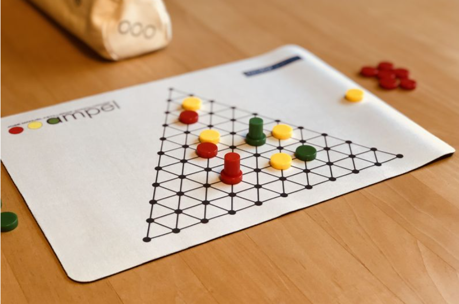

# PLOG - Proj1

### Grupo: Ampel_1, Turma 5

1 de novembro de 2020

| Nome 			                      |  Email instituicional |					   
| ----------------------------------- | ----------------------| 
| Luís Filipe Sousa Teixeira Recharte | up201806743@fe.up.pt  |
| Rita Matos Maranhão Peixoto         | up201806257@fe.up.pt  |

# Ampel


## **Introdução**

No âmbito da unidade curricular de Programação em Lógica, do Mestrado Integrado em Engenharia Informática e Computação, foi proposta a implementação de um jogo de tabuleiro para dois jogadores em linguagem Prolog, que respeitasse um aglomerado de regras que incluem as jogadas possíveis bem como as condições de terminação do jogo.

O jogo deve permitir três modos de utilização: Humano/Humano, Computador/Computador e Humano/Computador.

O jogo escolhido foi o jogo Ampel.

A interface com o utilizador foi realizada em modo de texto.

O sistema de desenvolvimento utilizado foi o SICStus Prolog 4.6.

O objetivo foi aplicar os conceitos abordados nas aulas teóricas e praticados nas aulas teórico-práticas.

Neste relatório será abordado todo o seu desenvolvimento, desde representação, regras de jogo a descrição detalhada da implementação com extratos de código para sua melhor compreensão.

## **Descrição do jogo**

O objetivo deste jogo é posicionar três discos numa linha de forma a corresponderem à sequência de um semáforo: vermelho-amarelo-verde, em qualquer direção.


**Componentes:**

-   Tabuleiro triangular com 66 pontos conectados
-   20 discos vermelhos e 20 discos verdes
-   10 discos amarelos
-   1 cilindro vermelho e 1 cilindro verde

**Regras:**

Começando com o tabuleiro vazio, cada jogador escolhe a sua cor. Começa então a fase de _set_ up: um jogador aleatório posiciona um disco amarelo numa posição qualquer interior do tabuleiro (não nas extremidades ou cantos), alternando com o outro jogador o posicionamento das peças amarelas. São colocadas entre 5 a 10 peças amarelas, que não são movidas durante todo o jogo.

Continuando a alternar, cada jogador vai jogar. Em cada jogada, o jogador tem que:

-   Mover um dos seus discos, se possível
-   Mover um dos discos do adversário, se possível (não podendo este conter o cilindro)
-   Adicionar um novo disco num ponto vazio do tabuleiro onde não forme diretamente um semáforo, movendo o seu cilindro para esta posição. Caso não tenha mais peças para acrescentar, remove o seu cilindro do tabuleiro.

**Regras de movimento de peças:**

-   Um disco move-se sempre em linha reta até encontrar uma obstrução (outra peça ou fim do tabuleiro), aí pode mudar a sua direção.
-   O número de espaços que uma peça se move (obrigatoriamente) é determinado pelo número de peças (incluindo a sua) que se encontram na linha do primeiro movimento.
-   O disco não pode inverter a direção a 180 graus e não pode acabar no sítio onde começou.
-   Caso não haja espaço suficiente para mover o disco respeitando as 3 regras acima, o disco não pode ser movido.

Quando um semáforo é formado, os três discos são removidos do tabuleiro, continuando a jogada e são devolvidas as peças aos jogadores correspondentes para voltar a utilizar. Se o semáforo incluir o cilindro do oponente, devolve-se o cilindro.

**Condições de terminação do jogo:**

O jogo termina quando um jogador removeu metade ou mais discos amarelos do tabuleiro (ex. 3 de 5, 5 de 10). Esse jogador é declarado vencedor.

Toda a informação referida neste tópico foi retirada dos seguintes links:

[Fonte](https://nestorgames.com/#ampel_detail)

[Instruções de Jogo](https://nestorgames.com/rulebooks/AMPEL_EN.pdf)

[Descrição extra do Jogo](https://www.boardgamegeek.com/boardgame/151978/ampel)

## **Representação interna do estado de jogo**

**Representação do tabuleiro**

O tabuleiro de jogo tem a forma triangular, sendo representado por uma lista constituída por várias listas que representam cada linha.
Cada célula é um elemento de uma lista que corresponda à sua linha. Cada célula tem um símbolo na representação interna que corresponde a um símbolo na visualização do tabuleiro. De seguida, temos um exemplo de uma implementação de um estado intermédio do jogo, em que já se encontram alguns discos no tabuleiro:
```
[
    [tab, tab, tab, tab, tab, tab, tab, tab, tab, tab, empty, tab, tab, tab, tab, tab, tab, tab, tab, tab, tab],
    [tab, tab, tab, tab, tab, tab, tab, tab, tab, empty, tab, empty, tab, tab, tab, tab, tab, tab, tab, tab, tab],
    [tab, tab, tab, tab, tab, tab, tab, tab, empty, tab, green, tab, empty, tab, tab, tab, tab, tab, tab, tab, tab],
    [tab, tab, tab, tab, tab, tab, tab, empty, tab, empty, tab, empty, tab, empty, tab, tab, tab, tab, tab, tab, tab],
    [tab, tab, tab, tab, tab, tab, empty, tab, empty, tab, empty, tab, empty, tab, empty, tab, tab, tab, tab, tab, tab],
    [tab, tab, tab, tab, tab, empty, tab, empty, tab, empty, tab, empty, tab, gcyl, tab, empty, tab, tab, tab, tab, tab],
    [tab, tab, tab, tab, empty, tab, yellow, tab, empty, tab, empty, tab, empty, tab, red, tab, empty, tab, tab, tab, tab],
    [tab, tab, tab, empty, tab, yellow, tab, empty, tab, empty, tab, empty, tab, empty, tab, empty, tab, empty, tab, tab, tab],
    [tab, tab, empty, tab, yellow, tab, red, tab, empty, tab, empty, tab, empty, tab, empty, tab, empty, tab, empty, tab, tab],
    [tab, empty, tab, yellow, tab, empty, tab, empty, tab, empty, tab, empty, tab, empty, tab, empty, tab, empty, tab, empty, tab],
    [empty, tab, yellow, tab, empty, tab, empty, tab, empty, tab, rcyl, tab, empty, tab, empty, tab, empty, tab, green, tab, empty]
]
```

A representação interna 'tab' são apenas células de offset para termos o alinhamento desejado do tabuleiro, por este ser triangular. No início do jogo todas as células têm o valor 'empty'.


**Representação dos jogadores**

Para além de ser necessário saber o estado do jogo ao longo do programa, há mais alguns detalhes necessários. Inclui-se aqui a ligação com os jogadores. Acerca de cada jogador deve ser guardado qual a cor das peças com que joga, o número de peças amarelas que já recolheu (número de semáforos que já formou), em que célula se encontra o seu cilindro e o número de discos que tem disponível para jogar. Toda esta informação é armazenada também numa lista player, implementada da seguinte forma:

```
player([Id, DiscsColor, NumberOfYellowDiscs, CylinderCollumn, CylinderRow, NumberOfDiscs])
```

A representação do tabuleiro descrita acima, traduz-se no seguinte output na consola do SICStus:	

- Estado inicial do tabuleiro
```
initialBoard([
    [tab, tab, tab, tab, tab, tab, tab, tab, tab, tab, empty, tab, tab, tab, tab, tab, tab, tab, tab, tab, tab],
    [tab, tab, tab, tab, tab, tab, tab, tab, tab, empty, tab, empty, tab, tab, tab, tab, tab, tab, tab, tab, tab],
    [tab, tab, tab, tab, tab, tab, tab, tab, empty, tab, empty, tab, empty, tab, tab, tab, tab, tab, tab, tab, tab],
    [tab, tab, tab, tab, tab, tab, tab, empty, tab, empty, tab, empty, tab, empty, tab, tab, tab, tab, tab, tab, tab],
    [tab, tab, tab, tab, tab, tab, empty, tab, empty, tab, empty, tab, empty, tab, empty, tab, tab, tab, tab, tab, tab],
    [tab, tab, tab, tab, tab, empty, tab, empty, tab, empty, tab, empty, tab, empty, tab, empty, tab, tab, tab, tab, tab],
    [tab, tab, tab, tab, empty, tab, empty, tab, empty, tab, empty, tab, empty, tab, empty, tab, empty, tab, tab, tab, tab],
    [tab, tab, tab, empty, tab, empty, tab, empty, tab, empty, tab, empty, tab, empty, tab, empty, tab, empty, tab, tab, tab],
    [tab, tab, empty, tab, empty, tab, empty, tab, empty, tab, empty, tab, empty, tab, empty, tab, empty, tab, empty, tab, tab],
    [tab, empty, tab, empty, tab, empty, tab, empty, tab, empty, tab, empty, tab, empty, tab, empty, tab, empty, tab, empty, tab],
    [empty, tab, empty, tab, empty, tab, empty, tab, empty, tab, empty, tab, empty, tab, empty, tab, empty, tab, empty, tab, empty]
]).

```


- Estado intermédio do tabuleiro

```
intermediateBoard([
    [tab, tab, tab, tab, tab, tab, tab, tab, tab, tab, empty, tab, tab, tab, tab, tab, tab, tab, tab, tab, tab],
    [tab, tab, tab, tab, tab, tab, tab, tab, tab, empty, tab, empty, tab, tab, tab, tab, tab, tab, tab, tab, tab],
    [tab, tab, tab, tab, tab, tab, tab, tab, empty, tab, green, tab, empty, tab, tab, tab, tab, tab, tab, tab, tab],
    [tab, tab, tab, tab, tab, tab, tab, empty, tab, empty, tab, empty, tab, empty, tab, tab, tab, tab, tab, tab, tab],
    [tab, tab, tab, tab, tab, tab, empty, tab, empty, tab, empty, tab, empty, tab, empty, tab, tab, tab, tab, tab, tab],
    [tab, tab, tab, tab, tab, empty, tab, empty, tab, empty, tab, empty, tab, gcyl, tab, empty, tab, tab, tab, tab, tab],
    [tab, tab, tab, tab, empty, tab, yellow, tab, empty, tab, empty, tab, empty, tab, red, tab, empty, tab, tab, tab, tab],
    [tab, tab, tab, empty, tab, yellow, tab, empty, tab, empty, tab, empty, tab, empty, tab, empty, tab, empty, tab, tab, tab],
    [tab, tab, empty, tab, yellow, tab, red, tab, empty, tab, empty, tab, empty, tab, empty, tab, empty, tab, empty, tab, tab],
    [tab, empty, tab, yellow, tab, empty, tab, empty, tab, empty, tab, empty, tab, empty, tab, empty, tab, empty, tab, empty, tab],
    [empty, tab, yellow, tab, empty, tab, empty, tab, empty, tab, rcyl, tab, empty, tab, empty, tab, empty, tab, green, tab, empty]
]).
```


- Estado final do tabuleiro

Atenção: o estado final deste jogo, é o caso em que se encontram menos de metade das peças amarelas colocadas inicialmente em jogo.

```
finalBoard([
    [tab, tab, tab, tab, tab, tab, tab, tab, tab, tab, empty, tab, tab, tab, tab, tab, tab, tab, tab, tab, tab],
    [tab, tab, tab, tab, tab, tab, tab, tab, tab, empty, tab, empty, tab, tab, tab, tab, tab, tab, tab, tab, tab],
    [tab, tab, tab, tab, tab, tab, tab, tab, empty, tab, green, tab, empty, tab, tab, tab, tab, tab, tab, tab, tab],
    [tab, tab, tab, tab, tab, tab, tab, empty, tab, empty, tab, empty, tab, empty, tab, tab, tab, tab, tab, tab, tab],
    [tab, tab, tab, tab, tab, tab, empty, tab, empty, tab, empty, tab, empty, tab, empty, tab, tab, tab, tab, tab, tab],
    [tab, tab, tab, tab, tab, empty, tab, empty, tab, empty, tab, empty, tab, gcyl, tab, empty, tab, tab, tab, tab, tab],
    [tab, tab, tab, tab, empty, tab, empty, tab, empty, tab, empty, tab, empty, tab, red, tab, empty, tab, tab, tab, tab],
    [tab, tab, tab, empty, tab, empty, tab, empty, tab, empty, tab, empty, tab, empty, tab, empty, tab, empty, tab, tab, tab],
    [tab, tab, empty, tab, empty, tab, red, tab, empty, tab, empty, tab, empty, tab, empty, tab, empty, tab, empty, tab, tab],
    [tab, empty, tab, yellow, tab, empty, tab, empty, tab, empty, tab, empty, tab, empty, tab, empty, tab, empty, tab, empty, tab],
    [empty, tab, yellow, tab, empty, tab, empty, tab, empty, tab, rcyl, tab, empty, tab, empty, tab, empty, tab, green, tab, empty]
]).
```
**Legenda** 
[Y] discos amarelos 

[R] discos vermelhos [G] discos verdes 

[W] discos vermelhos com cilindro [Z] discos verdes com cilindro

## **Visualização do estado de jogo**

A visualização do estado de jogo é possível através do predicado display_game/2, que recebe como argumentos uma lista correspondente ao estado atual do jogo e o jogador atual.

Tendo em conta o estado de jogo, vão ser obtidos na consola outputs semelhantes às imagens que se encontram no tópico anterior.

O predicado display_game/2 chama o predicado printBoard/0 que também recebe o estado atual do jogo, imprime a numeração das colunas e chama o predicado printLines/2.

O predicado printLines/2, recebe como argumentos a lista correspondente ao estado atual do jogo e o número identificador da linha que se encontra a imprimir, imprime todas as linhas do tabuleiro, chamando por cada linha o predicado printLine/1 e letter, que, como os nomes indicam, imprimem cada linha e a letra correspondente à linha, e,de seguida, chama-se recursivamente.

Este predicado chama-se recursivamente, fazendo uma chamada ao predicado printCell/1 que imprime cada célula da linha, recebendo o valor da representação interna do tipo de célula como argumento. Aqui é necessário usar o predicado symbol para saber a que carater de visualização corresponde esta representação interna de modo a obter o output esperado.

Nestas funções são tidas em atenção algumas características visuais do tabuleiro, de modo a tornar mais legível e apelativo, utilizando delimitadores de linha e colunas e separadores. Como descrito acima for adicionadas à visualização a numeração de linhas e colunas para uma interação mais fácil com o utilizador.

Algumas imagens descritivas do tabuleiro em diferentes estados do jogo:

- Estado inicial do tabuleiro
```
|---| 0 | 1 | 2 | 3 | 4 | 5 | 6 | 7 | 8 | 9 | 10| 11| 12| 13| 14| 15| 16| 17| 18| 19| 20|---|
|---|---|---|---|---|---|---|---|---|---|---|---|---|---|---|---|---|---|---|---|---|---|---|
| A | . | . | . | . | . | . | . | . | . | . | E | . | . | . | . | . | . | . | . | . | . | . |
|---|---|---|---|---|---|---|---|---|---|---|---|---|---|---|---|---|---|---|---|---|---|---|
| B | . | . | . | . | . | . | . | . | . | E | . | E | . | . | . | . | . | . | . | . | . | . |
|---|---|---|---|---|---|---|---|---|---|---|---|---|---|---|---|---|---|---|---|---|---|---|
| C | . | . | . | . | . | . | . | . | E | . | E | . | E | . | . | . | . | . | . | . | . | . |
|---|---|---|---|---|---|---|---|---|---|---|---|---|---|---|---|---|---|---|---|---|---|---|
| D | . | . | . | . | . | . | . | E | . | E | . | E | . | E | . | . | . | . | . | . | . | . |
|---|---|---|---|---|---|---|---|---|---|---|---|---|---|---|---|---|---|---|---|---|---|---|
| E | . | . | . | . | . | . | E | . | E | . | E | . | E | . | E | . | . | . | . | . | . | . |
|---|---|---|---|---|---|---|---|---|---|---|---|---|---|---|---|---|---|---|---|---|---|---|
| F | . | . | . | . | . | E | . | E | . | E | . | E | . | E | . | E | . | . | . | . | . | . |
|---|---|---|---|---|---|---|---|---|---|---|---|---|---|---|---|---|---|---|---|---|---|---|
| G | . | . | . | . | E | . | E | . | E | . | E | . | E | . | E | . | E | . | . | . | . | . |
|---|---|---|---|---|---|---|---|---|---|---|---|---|---|---|---|---|---|---|---|---|---|---|
| H | . | . | . | E | . | E | . | E | . | E | . | E | . | E | . | E | . | E | . | . | . | . |
|---|---|---|---|---|---|---|---|---|---|---|---|---|---|---|---|---|---|---|---|---|---|---|
| I | . | . | E | . | E | . | E | . | E | . | E | . | E | . | E | . | E | . | E | . | . | . |
|---|---|---|---|---|---|---|---|---|---|---|---|---|---|---|---|---|---|---|---|---|---|---|
| J | . | E | . | E | . | E | . | E | . | E | . | E | . | E | . | E | . | E | . | E | . | . |
|---|---|---|---|---|---|---|---|---|---|---|---|---|---|---|---|---|---|---|---|---|---|---|
| K | E | . | E | . | E | . | E | . | E | . | E | . | E | . | E | . | E | . | E | . | E | . |
|---|---|---|---|---|---|---|---|---|---|---|---|---|---|---|---|---|---|---|---|---|---|---|
yes
```

- Estado intermédio do tabuleiro
```
|---| 0 | 1 | 2 | 3 | 4 | 5 | 6 | 7 | 8 | 9 | 10| 11| 12| 13| 14| 15| 16| 17| 18| 19| 20|---|
|---|---|---|---|---|---|---|---|---|---|---|---|---|---|---|---|---|---|---|---|---|---|---|
| A | . | . | . | . | . | . | . | . | . | . | E | . | . | . | . | . | . | . | . | . | . | . |
|---|---|---|---|---|---|---|---|---|---|---|---|---|---|---|---|---|---|---|---|---|---|---|
| B | . | . | . | . | . | . | . | . | . | E | . | E | . | . | . | . | . | . | . | . | . | . |
|---|---|---|---|---|---|---|---|---|---|---|---|---|---|---|---|---|---|---|---|---|---|---|
| C | . | . | . | . | . | . | . | . | E | . | G | . | E | . | . | . | . | . | . | . | . | . |
|---|---|---|---|---|---|---|---|---|---|---|---|---|---|---|---|---|---|---|---|---|---|---|
| D | . | . | . | . | . | . | . | E | . | E | . | E | . | E | . | . | . | . | . | . | . | . |
|---|---|---|---|---|---|---|---|---|---|---|---|---|---|---|---|---|---|---|---|---|---|---|
| E | . | . | . | . | . | . | E | . | E | . | E | . | E | . | E | . | . | . | . | . | . | . |
|---|---|---|---|---|---|---|---|---|---|---|---|---|---|---|---|---|---|---|---|---|---|---|
| F | . | . | . | . | . | E | . | E | . | E | . | E | . | Z | . | E | . | . | . | . | . | . |
|---|---|---|---|---|---|---|---|---|---|---|---|---|---|---|---|---|---|---|---|---|---|---|
| G | . | . | . | . | E | . | Y | . | E | . | E | . | E | . | R | . | E | . | . | . | . | . |
|---|---|---|---|---|---|---|---|---|---|---|---|---|---|---|---|---|---|---|---|---|---|---|
| H | . | . | . | E | . | Y | . | E | . | E | . | E | . | E | . | E | . | E | . | . | . | . |
|---|---|---|---|---|---|---|---|---|---|---|---|---|---|---|---|---|---|---|---|---|---|---|
| I | . | . | E | . | Y | . | R | . | E | . | E | . | E | . | E | . | E | . | E | . | . | . |
|---|---|---|---|---|---|---|---|---|---|---|---|---|---|---|---|---|---|---|---|---|---|---|
| J | . | E | . | Y | . | E | . | E | . | E | . | E | . | E | . | E | . | E | . | E | . | . |
|---|---|---|---|---|---|---|---|---|---|---|---|---|---|---|---|---|---|---|---|---|---|---|
| K | E | . | Y | . | E | . | E | . | E | . | W | . | E | . | E | . | E | . | G | . | E | . |
|---|---|---|---|---|---|---|---|---|---|---|---|---|---|---|---|---|---|---|---|---|---|---|
```

- Estado final do tabuleiro
```
|---| 0 | 1 | 2 | 3 | 4 | 5 | 6 | 7 | 8 | 9 | 10| 11| 12| 13| 14| 15| 16| 17| 18| 19| 20|---|
|---|---|---|---|---|---|---|---|---|---|---|---|---|---|---|---|---|---|---|---|---|---|---|
| A | . | . | . | . | . | . | . | . | . | . | E | . | . | . | . | . | . | . | . | . | . | . |
|---|---|---|---|---|---|---|---|---|---|---|---|---|---|---|---|---|---|---|---|---|---|---|
| B | . | . | . | . | . | . | . | . | . | E | . | E | . | . | . | . | . | . | . | . | . | . |
|---|---|---|---|---|---|---|---|---|---|---|---|---|---|---|---|---|---|---|---|---|---|---|
| C | . | . | . | . | . | . | . | . | E | . | G | . | E | . | . | . | . | . | . | . | . | . |
|---|---|---|---|---|---|---|---|---|---|---|---|---|---|---|---|---|---|---|---|---|---|---|
| D | . | . | . | . | . | . | . | E | . | E | . | E | . | E | . | . | . | . | . | . | . | . |
|---|---|---|---|---|---|---|---|---|---|---|---|---|---|---|---|---|---|---|---|---|---|---|
| E | . | . | . | . | . | . | E | . | E | . | E | . | E | . | E | . | . | . | . | . | . | . |
|---|---|---|---|---|---|---|---|---|---|---|---|---|---|---|---|---|---|---|---|---|---|---|
| F | . | . | . | . | . | E | . | E | . | E | . | E | . | Z | . | E | . | . | . | . | . | . |
|---|---|---|---|---|---|---|---|---|---|---|---|---|---|---|---|---|---|---|---|---|---|---|
| G | . | . | . | . | E | . | E | . | E | . | E | . | E | . | R | . | E | . | . | . | . | . |
|---|---|---|---|---|---|---|---|---|---|---|---|---|---|---|---|---|---|---|---|---|---|---|
| H | . | . | . | E | . | E | . | E | . | E | . | E | . | E | . | E | . | E | . | . | . | . |
|---|---|---|---|---|---|---|---|---|---|---|---|---|---|---|---|---|---|---|---|---|---|---|
| I | . | . | E | . | E | . | R | . | E | . | E | . | E | . | E | . | E | . | E | . | . | . |
|---|---|---|---|---|---|---|---|---|---|---|---|---|---|---|---|---|---|---|---|---|---|---|
| J | . | E | . | Y | . | E | . | E | . | E | . | E | . | E | . | E | . | E | . | E | . | . |
|---|---|---|---|---|---|---|---|---|---|---|---|---|---|---|---|---|---|---|---|---|---|---|
| K | E | . | Y | . | E | . | E | . | E | . | W | . | E | . | E | . | E | . | G | . | E | . |
|---|---|---|---|---|---|---|---|---|---|---|---|---|---|---|---|---|---|---|---|---|---|---|
yes
```


## Informações extra

O programa deve ser corrido em SICStus. 

Tendo como Working Directory src, deve fazer Consult de play.pl e após o comando terminar, escrever play. na consola, de modo a correr o programa carregado, e será impresso o tabuleiro que estiver descomentado no predicado initial. 

Se desejar visualizar a representação do tabuleiro num estado diferente do jogo, deve descomentar na função initial o tabuleiro pretendido, mantendo os outros comentados.


Neste momento, há mais algumas funcionalidades implementadas, como os menus, que podem ser visualizados fazendo Consult de menu.pl e chamando o predicado start. Nos menus é possível escolher Play, que por agora apenas chama o predicado play e portanto faz display do tabuleiro na consola, Instructions que faz display das instruções do jogo na consola e Exit para terminar o programa. 
Acerca dos inputs nos menus, estes são ainda pouco robustos, pelo que cada número na escolha do menu tem que ser seguido de um ponto , ex: I., em que I representa um input numérico.

Para além disso, também já é possível fazer a colocação das peças amarelas sendo necessário descomentar as linhas finais do predicado play do ficheiro play.pl e de forma semelhante ao anteriormente referido, fazer Consult de play.pl e escrever play. na consola.