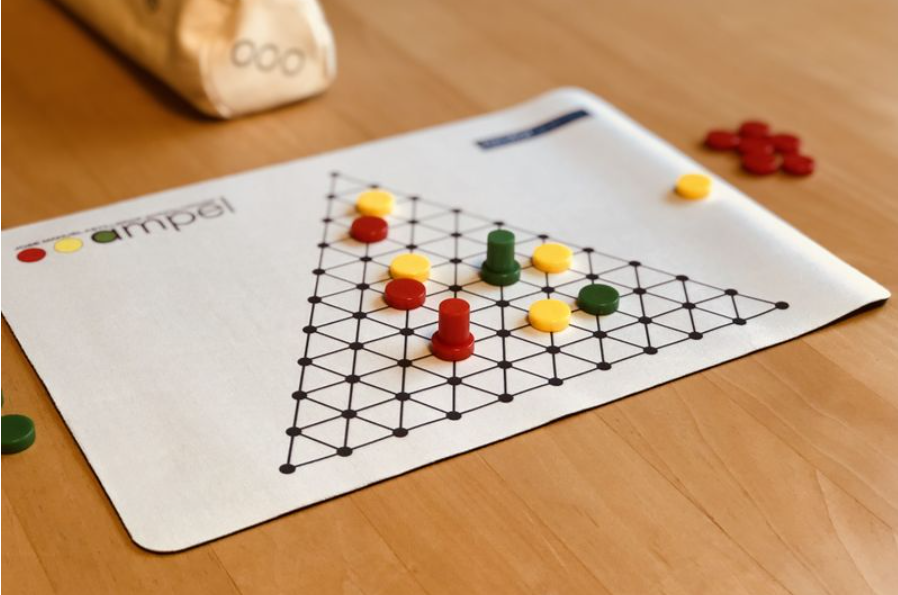

# PLOG - Proj1

### Grupo: Ampel_1, Turma 5

29 de novembro de 2020   

| Nome 			                      |  Email instituicional |					   
| ----------------------------------- | ----------------------| 
| Luís Filipe Sousa Teixeira Recharte | up201806743@fe.up.pt  |
| Rita Matos Maranhão Peixoto         | up201806257@fe.up.pt  |

# Ampel




## **Introdução**

No âmbito da unidade curricular de Programação em Lógica, do Mestrado Integrado em Engenharia Informática e Computação, foi proposta a implementação de um jogo de tabuleiro para dois jogadores em linguagem Prolog, que respeitasse um aglomerado de regras que incluem as jogadas possíveis bem como as condições de terminação do jogo.

O jogo deve permitir três modos de utilização: Humano/Humano, Computador/Computador e Humano/Computador.

O jogo escolhido foi o jogo Ampel.

A interface com o utilizador foi realizada em modo de texto.

O sistema de desenvolvimento utilizado foi o SICStus Prolog 4.6.

O objetivo foi aplicar os conceitos abordados nas aulas teóricas e praticados nas aulas teórico-práticas.

Neste relatório será abordado todo o seu desenvolvimento, desde representação, regras de jogo a descrição detalhada da implementação com extratos de código para sua melhor compreensão.

## **Descrição do jogo**

O objetivo deste jogo é posicionar três discos numa linha de forma a corresponderem à sequência de um semáforo: vermelho-amarelo-verde, em qualquer direção.


**Componentes:**

-   Tabuleiro triangular com 66 pontos conectados
-   20 discos vermelhos e 20 discos verdes
-   10 discos amarelos
-   1 cilindro vermelho e 1 cilindro verde

**Regras:**

Começando com o tabuleiro vazio, cada jogador escolhe a sua cor. Começa então a fase de _set_ up: um jogador aleatório posiciona um disco amarelo numa posição qualquer interior do tabuleiro (não nas extremidades ou cantos), alternando com o outro jogador o posicionamento das peças amarelas. São colocadas entre 5 a 10 peças amarelas, que não são movidas durante todo o jogo.

Continuando a alternar, cada jogador vai jogar. Em cada jogada, o jogador tem que:

-   Mover um dos seus discos, se possível
-   Mover um dos discos do adversário, se possível (não podendo este conter o cilindro)
-   Adicionar um novo disco num ponto vazio do tabuleiro onde não forme diretamente um semáforo, movendo o seu cilindro para esta posição. Caso não tenha mais peças para acrescentar, remove o seu cilindro do tabuleiro.

**Regras de movimento de peças:**

-   Um disco move-se sempre em linha reta até encontrar uma obstrução (outra peça ou fim do tabuleiro), aí pode mudar a sua direção.
-   O número de espaços que uma peça se move (obrigatoriamente) é determinado pelo número de peças (incluindo a sua) que se encontram na linha do primeiro movimento.
-   O disco não pode inverter a direção a 180 graus e não pode acabar no sítio onde começou.
-   Caso não haja espaço suficiente para mover o disco respeitando as 3 regras acima, o disco não pode ser movido.

Quando um semáforo é formado, os três discos são removidos do tabuleiro, continuando a jogada e são devolvidas as peças aos jogadores correspondentes para voltar a utilizar. Se o semáforo incluir o cilindro do oponente, devolve-se o cilindro.

**Condições de terminação do jogo:**

O jogo termina quando um jogador removeu metade ou mais discos amarelos do tabuleiro (ex. 3 de 5, 5 de 10). Esse jogador é declarado vencedor.

Toda a informação referida neste tópico foi retirada dos seguintes links:

[Fonte](https://nestorgames.com/#ampel_detail)

[Instruções de Jogo](https://nestorgames.com/rulebooks/AMPEL_EN.pdf)

[Descrição extra do Jogo](https://www.boardgamegeek.com/boardgame/151978/ampel)


## Lógica do jogo
### **Representação interna do estado de jogo**

**Representação do tabuleiro**

O tabuleiro de jogo tem a forma triangular, sendo representado por uma lista constituída por várias listas que representam cada linha.
Cada célula é um elemento de uma lista que corresponde à sua linha. Cada célula tem um símbolo na representação interna que corresponde a um símbolo na visualização do tabuleiro. De seguida, temos um exemplo de uma implementação de um estado intermédio do jogo, em que já se encontram alguns discos no tabuleiro:
```
[
    [tab, tab, tab, tab, tab, tab, tab, tab, tab, tab, empty, tab, tab, tab, tab, tab, tab, tab, tab, tab, tab],
    [tab, tab, tab, tab, tab, tab, tab, tab, tab, empty, tab, empty, tab, tab, tab, tab, tab, tab, tab, tab, tab],
    [tab, tab, tab, tab, tab, tab, tab, tab, empty, tab, green, tab, empty, tab, tab, tab, tab, tab, tab, tab, tab],
    [tab, tab, tab, tab, tab, tab, tab, empty, tab, empty, tab, empty, tab, empty, tab, tab, tab, tab, tab, tab, tab],
    [tab, tab, tab, tab, tab, tab, empty, tab, empty, tab, empty, tab, empty, tab, empty, tab, tab, tab, tab, tab, tab],
    [tab, tab, tab, tab, tab, empty, tab, empty, tab, empty, tab, empty, tab, gcyl, tab, empty, tab, tab, tab, tab, tab],
    [tab, tab, tab, tab, empty, tab, yellow, tab, empty, tab, empty, tab, empty, tab, red, tab, empty, tab, tab, tab, tab],
    [tab, tab, tab, empty, tab, yellow, tab, empty, tab, empty, tab, empty, tab, empty, tab, empty, tab, empty, tab, tab, tab],
    [tab, tab, empty, tab, yellow, tab, red, tab, empty, tab, empty, tab, empty, tab, empty, tab, empty, tab, empty, tab, tab],
    [tab, empty, tab, yellow, tab, empty, tab, empty, tab, empty, tab, empty, tab, empty, tab, empty, tab, empty, tab, empty, tab],
    [empty, tab, empty, tab, empty, tab, empty, tab, empty, tab, rcyl, tab, empty, tab, empty, tab, empty, tab, green, tab, empty]
]
```

A representação interna 'tab' são apenas células de offset para termos o alinhamento desejado do tabuleiro, por este ser triangular. No início do jogo todas as células têm o valor 'empty'.


**Representação dos jogadores**

Para além de ser necessário saber o estado do jogo ao longo do programa, há mais alguns detalhes necessários. Inclui-se aqui a ligação com os jogadores. Acerca de cada jogador deve ser guardado o seu id (1 ou 2) qual a cor das peças com que joga (vermelho ou verde), o número de peças amarelas que já recolheu (número de semáforos que já formou), em que célula se encontra o seu cilindro (linha e coluna) e o número de discos que tem disponíveis para jogar. Toda esta informação é armazenada também numa lista player, implementada da seguinte forma:

```
[Id, DiscsColor, NumberOfYellowDiscs, CylinderCollumn, CylinderRow, NumberOfDiscs]
```
**Representação do estado de jogo**

 O estado do jogo é representado como uma lista de listas, constituída por uma lista com o estado do tabuleiro, duas listas com o estado dos jogadores e uma lista com o valor do número de amarelos colocados inicialmente no tabuleiro.


A representação do tabuleiro descrita acima, traduz-se no seguinte output na consola do SICStus:	

- Estado inicial do tabuleiro
```
initialBoard([
    [tab, tab, tab, tab, tab, tab, tab, tab, tab, tab, empty, tab, tab, tab, tab, tab, tab, tab, tab, tab, tab],
    [tab, tab, tab, tab, tab, tab, tab, tab, tab, empty, tab, empty, tab, tab, tab, tab, tab, tab, tab, tab, tab],
    [tab, tab, tab, tab, tab, tab, tab, tab, empty, tab, empty, tab, empty, tab, tab, tab, tab, tab, tab, tab, tab],
    [tab, tab, tab, tab, tab, tab, tab, empty, tab, empty, tab, empty, tab, empty, tab, tab, tab, tab, tab, tab, tab],
    [tab, tab, tab, tab, tab, tab, empty, tab, empty, tab, empty, tab, empty, tab, empty, tab, tab, tab, tab, tab, tab],
    [tab, tab, tab, tab, tab, empty, tab, empty, tab, empty, tab, empty, tab, empty, tab, empty, tab, tab, tab, tab, tab],
    [tab, tab, tab, tab, empty, tab, empty, tab, empty, tab, empty, tab, empty, tab, empty, tab, empty, tab, tab, tab, tab],
    [tab, tab, tab, empty, tab, empty, tab, empty, tab, empty, tab, empty, tab, empty, tab, empty, tab, empty, tab, tab, tab],
    [tab, tab, empty, tab, empty, tab, empty, tab, empty, tab, empty, tab, empty, tab, empty, tab, empty, tab, empty, tab, tab],
    [tab, empty, tab, empty, tab, empty, tab, empty, tab, empty, tab, empty, tab, empty, tab, empty, tab, empty, tab, empty, tab],
    [empty, tab, empty, tab, empty, tab, empty, tab, empty, tab, empty, tab, empty, tab, empty, tab, empty, tab, empty, tab, empty]
]).

```


- Estado intermédio do tabuleiro

```
intermediateBoard([
    [tab, tab, tab, tab, tab, tab, tab, tab, tab, tab, empty, tab, tab, tab, tab, tab, tab, tab, tab, tab, tab],
    [tab, tab, tab, tab, tab, tab, tab, tab, tab, empty, tab, empty, tab, tab, tab, tab, tab, tab, tab, tab, tab],
    [tab, tab, tab, tab, tab, tab, tab, tab, empty, tab, green, tab, empty, tab, tab, tab, tab, tab, tab, tab, tab],
    [tab, tab, tab, tab, tab, tab, tab, empty, tab, empty, tab, empty, tab, empty, tab, tab, tab, tab, tab, tab, tab],
    [tab, tab, tab, tab, tab, tab, empty, tab, empty, tab, empty, tab, empty, tab, empty, tab, tab, tab, tab, tab, tab],
    [tab, tab, tab, tab, tab, empty, tab, yellow, tab, empty, tab, empty, tab, gcyl, tab, empty, tab, tab, tab, tab, tab],
    [tab, tab, tab, tab, empty, tab, yellow, tab, empty, tab, empty, tab, empty, tab, red, tab, empty, tab, tab, tab, tab],
    [tab, tab, tab, empty, tab, yellow, tab, empty, tab, empty, tab, empty, tab, empty, tab, empty, tab, empty, tab, tab, tab],
    [tab, tab, empty, tab, yellow, tab, red, tab, empty, tab, empty, tab, empty, tab, empty, tab, empty, tab, empty, tab, tab],
    [tab, empty, tab, yellow, tab, empty, tab, empty, tab, empty, tab, empty, tab, empty, tab, empty, tab, empty, tab, empty, tab],
    [empty, tab, empty, tab, empty, tab, empty, tab, empty, tab, rcyl, tab, empty, tab, empty, tab, empty, tab, green, tab, empty]
]).
```


- Estado final do tabuleiro

Atenção: o estado final deste jogo, é o caso em que se encontram menos de metade das peças amarelas colocadas inicialmente em jogo.

```
finalBoard([
    [tab, tab, tab, tab, tab, tab, tab, tab, tab, tab, empty, tab, tab, tab, tab, tab, tab, tab, tab, tab, tab],
    [tab, tab, tab, tab, tab, tab, tab, tab, tab, empty, tab, empty, tab, tab, tab, tab, tab, tab, tab, tab, tab],
    [tab, tab, tab, tab, tab, tab, tab, tab, empty, tab, green, tab, empty, tab, tab, tab, tab, tab, tab, tab, tab],
    [tab, tab, tab, tab, tab, tab, tab, empty, tab, empty, tab, empty, tab, empty, tab, tab, tab, tab, tab, tab, tab],
    [tab, tab, tab, tab, tab, tab, empty, tab, empty, tab, empty, tab, empty, tab, empty, tab, tab, tab, tab, tab, tab],
    [tab, tab, tab, tab, tab, empty, tab, empty, tab, empty, tab, empty, tab, gcyl, tab, empty, tab, tab, tab, tab, tab],
    [tab, tab, tab, tab, empty, tab, empty, tab, empty, tab, empty, tab, empty, tab, red, tab, empty, tab, tab, tab, tab],
    [tab, tab, tab, empty, tab, empty, tab, empty, tab, empty, tab, empty, tab, empty, tab, empty, tab, empty, tab, tab, tab],
    [tab, tab, empty, tab, empty, tab, red, tab, empty, tab, empty, tab, empty, tab, empty, tab, empty, tab, empty, tab, tab],
    [tab, empty, tab, yellow, tab, empty, tab, empty, tab, empty, tab, empty, tab, empty, tab, empty, tab, empty, tab, empty, tab],
    [empty, tab, empty, tab, empty, tab, empty, tab, empty, tab, rcyl, tab, empty, tab, empty, tab, empty, tab, green, tab, empty]
]).
```

### **Visualização do estado de jogo**

A visualização do estado de jogo é possível através do predicado display_game/2, que recebe como argumentos uma lista correspondente ao estado atual do jogo , ou seja, uma lista com o tabuleiro atual e os jogadores , e o jogador atual.

Tendo em conta o estado de jogo, vão ser obtidos na consola outputs semelhantes às imagens que se encontram no tópico anterior.

O predicado display_game/2 chama o predicado printBoard/0 que também recebe o estado atual do jogo, imprime a numeração das colunas e chama o predicado printLines/2 e chama também o predicado display_players/2 que imprime a informação atual dos jogadores de forma formatada, tornando mais facil o acompanhamento do jogo.

O predicado printLines/2, recebe como argumentos a lista correspondente ao estado atual do jogo e o número identificador da linha que se encontra a imprimir, imprime todas as linhas do tabuleiro, chamando por cada linha o predicado printLine/1 e rowNumber, que, como os nomes indicam, imprimem cada linha e a letra correspondente à linha, e, de seguida, chama-se recursivamente.

Este predicado chama-se recursivamente, fazendo uma chamada ao predicado printCell/1 que imprime cada célula da linha, recebendo o valor da representação interna do tipo de célula como argumento. Aqui é necessário usar o predicado symbol para saber a que carater de visualização corresponde esta representação interna de modo a obter o output esperado.

Nestas funções são tidas em atenção algumas características visuais do tabuleiro, de modo a torná-lo mais legível e apelativo, utilizando delimitadores de linha e colunas e separadores. Como descrito acima foram adicionadas à visualização a numeração de linhas e colunas para uma interação mais fácil com o utilizador.

Algumas imagens descritivas do tabuleiro em diferentes estados do jogo:

- Estado inicial do tabuleiro
```

    |---| 0 | 1 | 2 | 3 | 4 | 5 | 6 | 7 | 8 | 9 | 10| 11| 12| 13| 14| 15| 16| 17| 18| 19| 20|---|
    |---|---|---|---|---|---|---|---|---|---|---|---|---|---|---|---|---|---|---|---|---|---|---|
    | A | . | . | . | . | . | . | . | . | . | . | * | . | . | . | . | . | . | . | . | . | . | . |
    |---|---|---|---|---|---|---|---|---|---|---|---|---|---|---|---|---|---|---|---|---|---|---|
    | B | . | . | . | . | . | . | . | . | . | * | . | * | . | . | . | . | . | . | . | . | . | . |
    |---|---|---|---|---|---|---|---|---|---|---|---|---|---|---|---|---|---|---|---|---|---|---|
    | C | . | . | . | . | . | . | . | . | * | . | * | . | * | . | . | . | . | . | . | . | . | . |
    |---|---|---|---|---|---|---|---|---|---|---|---|---|---|---|---|---|---|---|---|---|---|---|
    | D | . | . | . | . | . | . | . | * | . | * | . | * | . | * | . | . | . | . | . | . | . | . |
    |---|---|---|---|---|---|---|---|---|---|---|---|---|---|---|---|---|---|---|---|---|---|---|
    | E | . | . | . | . | . | . | * | . | * | . | * | . | * | . | * | . | . | . | . | . | . | . |
    |---|---|---|---|---|---|---|---|---|---|---|---|---|---|---|---|---|---|---|---|---|---|---|
    | F | . | . | . | . | . | * | . | * | . | * | . | * | . | * | . | * | . | . | . | . | . | . |
    |---|---|---|---|---|---|---|---|---|---|---|---|---|---|---|---|---|---|---|---|---|---|---|
    | G | . | . | . | . | * | . | * | . | * | . | * | . | * | . | * | . | * | . | . | . | . | . |
    |---|---|---|---|---|---|---|---|---|---|---|---|---|---|---|---|---|---|---|---|---|---|---|
    | H | . | . | . | * | . | * | . | * | . | * | . | * | . | * | . | * | . | * | . | . | . | . |
    |---|---|---|---|---|---|---|---|---|---|---|---|---|---|---|---|---|---|---|---|---|---|---|
    | I | . | . | * | . | * | . | * | . | * | . | * | . | * | . | * | . | * | . | * | . | . | . |
    |---|---|---|---|---|---|---|---|---|---|---|---|---|---|---|---|---|---|---|---|---|---|---|
    | J | . | * | . | * | . | * | . | * | . | * | . | * | . | * | . | * | . | * | . | * | . | . |
    |---|---|---|---|---|---|---|---|---|---|---|---|---|---|---|---|---|---|---|---|---|---|---|
    | K | * | . | * | . | * | . | * | . | * | . | * | . | * | . | * | . | * | . | * | . | * | . |
    |---|---|---|---|---|---|---|---|---|---|---|---|---|---|---|---|---|---|---|---|---|---|---|

        Player 1                                               Player 2
            Yellows: 0                                             Yellows: 0
            Cylinder: [0,0]                                        Cylinder: [0,0]
            Reds: 20                                               Greens: 20

```

- Estado intermédio do tabuleiro
```

    |---| 0 | 1 | 2 | 3 | 4 | 5 | 6 | 7 | 8 | 9 | 10| 11| 12| 13| 14| 15| 16| 17| 18| 19| 20|---|
    |---|---|---|---|---|---|---|---|---|---|---|---|---|---|---|---|---|---|---|---|---|---|---|
    | A | . | . | . | . | . | . | . | . | . | . | * | . | . | . | . | . | . | . | . | . | . | . |
    |---|---|---|---|---|---|---|---|---|---|---|---|---|---|---|---|---|---|---|---|---|---|---|
    | B | . | . | . | . | . | . | . | . | . | * | . | * | . | . | . | . | . | . | . | . | . | . |
    |---|---|---|---|---|---|---|---|---|---|---|---|---|---|---|---|---|---|---|---|---|---|---|
    | C | . | . | . | . | . | . | . | . | * | . | G | . | * | . | . | . | . | . | . | . | . | . |
    |---|---|---|---|---|---|---|---|---|---|---|---|---|---|---|---|---|---|---|---|---|---|---|
    | D | . | . | . | . | . | . | . | * | . | * | . | * | . | * | . | . | . | . | . | . | . | . |
    |---|---|---|---|---|---|---|---|---|---|---|---|---|---|---|---|---|---|---|---|---|---|---|
    | E | . | . | . | . | . | . | Z | . | * | . | * | . | * | . | R | . | . | . | . | . | . | . |
    |---|---|---|---|---|---|---|---|---|---|---|---|---|---|---|---|---|---|---|---|---|---|---|
    | F | . | . | . | . | . | * | . | Y | . | R | . | * | . | G | . | * | . | . | . | . | . | . |
    |---|---|---|---|---|---|---|---|---|---|---|---|---|---|---|---|---|---|---|---|---|---|---|
    | G | . | . | . | . | * | . | Y | . | * | . | * | . | * | . | R | . | * | . | . | . | . | . |
    |---|---|---|---|---|---|---|---|---|---|---|---|---|---|---|---|---|---|---|---|---|---|---|
    | H | . | . | . | * | . | Y | . | * | . | * | . | * | . | R | . | * | . | * | . | . | . | . |
    |---|---|---|---|---|---|---|---|---|---|---|---|---|---|---|---|---|---|---|---|---|---|---|
    | I | . | . | * | . | Y | . | G | . | * | . | R | . | * | . | * | . | * | . | * | . | . | . |
    |---|---|---|---|---|---|---|---|---|---|---|---|---|---|---|---|---|---|---|---|---|---|---|
    | J | . | * | . | Y | . | * | . | * | . | * | . | * | . | * | . | * | . | * | . | * | . | . |
    |---|---|---|---|---|---|---|---|---|---|---|---|---|---|---|---|---|---|---|---|---|---|---|
    | K | * | . | * | . | * | . | * | . | * | . | W | . | * | . | * | . | * | . | G | . | * | . |
    |---|---|---|---|---|---|---|---|---|---|---|---|---|---|---|---|---|---|---|---|---|---|---|

        Player 1                                               Player 2
            Yellows: 0                                             Yellows: 0
            Cylinder: [K,10]                                        Cylinder: [E,6]
            Reds: 14                                               Greens: 15

```

- Estado final do tabuleiro
```

    |---| 0 | 1 | 2 | 3 | 4 | 5 | 6 | 7 | 8 | 9 | 10| 11| 12| 13| 14| 15| 16| 17| 18| 19| 20|---|
    |---|---|---|---|---|---|---|---|---|---|---|---|---|---|---|---|---|---|---|---|---|---|---|
    | A | . | . | . | . | . | . | . | . | . | . | * | . | . | . | . | . | . | . | . | . | . | . |
    |---|---|---|---|---|---|---|---|---|---|---|---|---|---|---|---|---|---|---|---|---|---|---|
    | B | . | . | . | . | . | . | . | . | . | * | . | * | . | . | . | . | . | . | . | . | . | . |
    |---|---|---|---|---|---|---|---|---|---|---|---|---|---|---|---|---|---|---|---|---|---|---|
    | C | . | . | . | . | . | . | . | . | * | . | G | . | * | . | . | . | . | . | . | . | . | . |
    |---|---|---|---|---|---|---|---|---|---|---|---|---|---|---|---|---|---|---|---|---|---|---|
    | D | . | . | . | . | . | . | . | * | . | * | . | * | . | * | . | . | . | . | . | . | . | . |
    |---|---|---|---|---|---|---|---|---|---|---|---|---|---|---|---|---|---|---|---|---|---|---|
    | E | . | . | . | . | . | . | * | . | * | . | * | . | * | . | * | . | . | . | . | . | . | . |
    |---|---|---|---|---|---|---|---|---|---|---|---|---|---|---|---|---|---|---|---|---|---|---|
    | F | . | . | . | . | . | * | . | * | . | * | . | * | . | Z | . | * | . | . | . | . | . | . |
    |---|---|---|---|---|---|---|---|---|---|---|---|---|---|---|---|---|---|---|---|---|---|---|
    | G | . | . | . | . | * | . | * | . | * | . | * | . | * | . | R | . | * | . | . | . | . | . |
    |---|---|---|---|---|---|---|---|---|---|---|---|---|---|---|---|---|---|---|---|---|---|---|
    | H | . | . | . | * | . | * | . | * | . | * | . | * | . | * | . | * | . | * | . | . | . | . |
    |---|---|---|---|---|---|---|---|---|---|---|---|---|---|---|---|---|---|---|---|---|---|---|
    | I | . | . | G | . | * | . | * | . | * | . | * | . | * | . | * | . | * | . | * | . | . | . |
    |---|---|---|---|---|---|---|---|---|---|---|---|---|---|---|---|---|---|---|---|---|---|---|
    | J | . | * | . | Y | . | R | . | * | . | * | . | * | . | * | . | * | . | * | . | * | . | . |
    |---|---|---|---|---|---|---|---|---|---|---|---|---|---|---|---|---|---|---|---|---|---|---|
    | K | * | . | * | . | * | . | * | . | * | . | W | . | * | . | * | . | * | . | G | . | * | . |
    |---|---|---|---|---|---|---|---|---|---|---|---|---|---|---|---|---|---|---|---|---|---|---|

        Player 1                                               Player 2
            Yellows: 3                                             Yellows: 1
            Cylinder: [G,14]                                        Cylinder: [K,10]
            Reds: 17                                               Greens: 16

```

**Legenda** 

[Y] discos amarelos 

[R] discos vermelhos [G] discos verdes 

[W] discos vermelhos com cilindro [Z] discos verdes com cilindro

[*] célula vazia

O jogo inicia com a identificação do jogo e do grupo passando para um menu onde se pode escolher jogar ('play'), ver as instruções do jogo ('instructions') ou sair do jogo ('exit). Se o utilizador escolher a opção 1, jogar, será encaminhado para um menu onde escolhe o tipo dos jogadores, ou seja, se o jogo vai ser jogador contra jogador, jogador contra computador ou computador contra computador. Se a opção envolver computador é, posteriormente, encaminhado para um menu onde escolhe o nível do jogo: fácil ('easy') ou médio ('medium') e cuja seleção leva ao início do jogo. Se nenhum dos jogadores for o computador, passa diretamente para o início do jogo. Todos os menus possuem a opção de voltar ao menu anterior ('previous menu') e/ou terminar o jogo ('exit'). Se o utilizador escolher a opção 2, ver as instruções, são impressas no terminal as instruções detalhadas do jogo. Se a opção do utilizador for a 3, é mostrada uma mensagem de despedida e o programa termina.


Seguem-se alguns exemplos ilustrativos dos menus:

- Início
```
     _    __  __ ____  _____ _     
    / \  |  \/  |  _ \| ____| |    
   / _ \ | |\/| | |_) |  _| | |    
  / ___ \| |  | |  __/| |___| |___ 
 /_/   \_\_|  |_|_|   |_____|_____|
                                   
           Rita Peixoto            
         Filipe Recharte           

Press <Enter> to continue.

```

- Menu Principal
```
==================================
=           :: Ampel ::          =
==================================
=                                =
=   1. Play                      =
=   2. Instructions              =
=   3. Exit                      =
=                                =
==================================

```

- Menu de tipos de jogadores
```
==================================
=           :: Ampel ::          =
==================================
=                                =
= Choose the player types:       =
=                                =
=   1. Player vs Player          =
=   2. Player vs Computer        =
=   3. Computer vs Computer      =
=   4. Previous Menu             =
=   5. Exit                      =
=                                =
==================================

```

- Menu de nível de dificuldade
```
==================================
=           :: Ampel ::          =
==================================
=                                =
= Choose the difficulty level:   =
=                                =
=   1. Easy (Random)             =
=   2. Medium  (Greedy)          =
=   3. Previous Menu             =
=   4. Exit                      =
=                                =
==================================

```

- Instruções
```
 ___ _  _ ___ _____ ___ _   _  ___ _____ ___ ___  _  _ ___ 
|_ _| \| / __|_   _| _ \ | | |/ __|_   _|_ _/ _ \| \| / __|
 | |  .` \__ \ | | |   / |_| | (__  | |  | | (_) | .` \__ \ 
|___|_|\_|___/ |_| |_|_\\___/ \___| |_| |___\___/|_|\_|___/

**MATERIALS**        
    A triangular board with 66 connected points
    20 red discs (R) and 20 green discs (G)
    10 yellow discs (Y)
    1 red cylinder (W, represents the red disc with the cylinder) and 1 green cylinder((Z, represents the green disc with the cylinder))
                            
**RULES**                   
   1. Each player selects a color
                            
   2. Until there are AT LEAST 5 yellow discs on the board (MAX 10), the players take turns
adding a disc to an empty point NOT INCLUDING the edges or corners
                            
   3. On your turn, you must perform the following steps in order:
         - Move one of your discs if possible
         - Move one of your opponents disc if possible. You cannot move discs with cylinders in it.
         - Add one of your discs to an empty point, and put your cylinder on it
           If you had no discs to place, take your cylinder off the board
           You are NEVER ALOWED to add a disc in such a way that it directly makes a traffic signal

Press <Enter> to continue.


```

### **Fluxo normal do jogo**

O jogo começa com o display do tabuleiro vazio, sendo os jogadores avisados que devem proceder ao posicionamento das peças amarelas. 

Alternadamente, começando com o jogador 1, os jogadores vão escolhendo a linha e coluna onde pretendem colocar o disco amarelo, sendo que este não pode ser colocado nem na borda do tabuleiro nem nos cantos. Se for um local válido, o disco amarelo é colocado, senão é pedido de novo o input. Antes de o próximo jogador escolher o local onde colocar o disco, é perguntado se pretende continuar a colocar ou terminar a colocação. Se a escolha for terminar a colocação é verificado se já foram colocados o número mínimo de discos (5) e se sim, termina-se a colocação das peças amarelas seguindo-se para o ciclo do jogo. Esta colocação também termina se o número máximo de discos já tiver sido colocado no tabuleiro (10).
No caso do jogador ser o computador é escolhido um local válido aleatório para colocar o disco amarelo. Se o jogo for computador contra computador é colocado o número máximo de discos amarelos, se for humano contra computador, ou a colocação é terminada pelo jogador humano ou termina quando forem colocados o número máximo de discos.

Após isto, inicia-se o loop do jogo, gameLoop/3. O loop do jogo consiste em alternar jogadas do jogador 1 com o jogador 2 através do predicado playerTurn/6. 
Cada jogador deve mover um dos seus discos (se possivel), mover um dos discos do adversário (se possivel) e adicionar um dos seus discos ao tabuleiro. Se em alguns dos seus movimentos o jogador formou um semaforo, antes de mudar de jogador é verificado se o jogo terminou ou não, sendo que para terminar o jogador tem que ter recolhido mais de metade dos discos amarelos colocados inicialmente no tabuleiro. Se o jogo terminou, é impresso no terminal o jogador vencedor e o jogo termina, caso contrário passa a vez ao próximo jogador.

Todas estas componentes das jogadas têm regras adicionais que vão ser descritas nos tópicos seguintes.


### **Lista de jogadas válidas**

Todas as jogadas que um jogador pretende executar são validadas ou não de acordo com as regras do jogo. Para tal são utilizados dois predicados, um para obter os movimentos válidos, valid_moves/3, e um para obter os locais válidos para adicionar um disco, valid_adds/3.

O predicado valid_moves recebe o estado do jogo e a cor do jogador e retorna uma lista com todas os movimentos possíveis, de acordo com o estado atual do tabuleiro. Começa por ver em que celulas se encontram as peças do jogador, através do predicado iterate_board/6. Chama, de seguida, o predicado getAllMoves/3, que por cada disco chama o predicado getDiscValidPlays/3 para obter todas as células para onde aquele disco pode ir, de acordo com as regras do jogo, adicionando à lista de retorno que é uma lista de listas cuja cabeça é a célula atual do disco e a cauda são todas as células para onde o disco pode ser movido. O predicado getDiscValidPlays é o predicado que: obtém quantas células a peça pode andar tendo em conta a direção que toma inicialmente com o predicado canMove/9 que calcula quantas peças se encontram em cada direção de jogada. Depois, chama o predicado generatePath/8 que encontra todos os caminhos possiveis daquele disco começando numa certa direção e podendo, portanto, andar um certo número de células. O predicado generatePath/8 o que faz é, enquanto tiver células para andar, tenta primeiro seguir sempre a direção inicial (uma das regras é andar sempre que possível em linha reta), se for possível andar, isto é, não colidir com nenhuma outra peça ou sair fora do tabuleiro, anda; caso contrário, experimenta outra direção aleatória para se desviar dos obstáculos e depois continua sempre primeiro a tentar seguir a mesma direção. No predicado getDiscValidPlays é  utilizado o findall para obter todos os caminhos possiveis em cada direçao chamando o generatePath. Por fim, este predicado adiciona todas as células finais possíveis à lista de retorno.

O predicado valid_adds/3, obtém todas as células vazias do tabuleiro e verifica em quais delas é possível colocar um disco. Esta verificação consiste em ver se colocar um disco da cor do jogador naquela célula forma ou não um semáforo, através do predicado verifyTrafficSignal/6. Se formar não é possível colocar lá um disco, mais uma das regras do jogo; caso contrário, é possível. Sendo possível, esta célula é adicionada à lista de retorno.


Nota: células são representadas da forma [R,C], em que R é a linha e C é a coluna onde a célula se encontra.


### **Execução de jogadas**

Quando um jogador tem que mover uma peça, tanto sua como do oponente, são chamados, respetivamente, os predicados moveMyDisc/3 e moveOponnentDisc/3, que são semelhantes. Começam por obter a lista de jogadas válidas e se for um jogador humano pede o input da jogada pretendida e verifica se é uma jogada válida com inputMoveDisc/5, isto é, se pertence à lista de jogadas válidas, caso contrário pede novo input, se for um computador chama o predicado choose_move/4 que retorna a jogada a executar. Após a decisão da jogada, é chamado o predicado movingDiscs/6 que move a peça a através do predicado move/3 e verifica se foi formado um semaforo ou não, com o predicado verifyTrafficSignal/6. No caso de um semáforo ser formado, é necessário devolver as peças aos jogadores, incrementar o número de discos amarelos do jogador e se alguma das peças for um cilindro, este também é devolvido ao jogador correspondente.

Quando é a vez do jogador adicionar uma peça, são determinadas as células onde é válido colocar um disco através do predicado valid_adds/3. Se for um jogador humano é pedido input de uma célula onde colocar o disco até esta ser válida: pertencer à lista de adições válidas; se o jogador for o computador é chamado o predicado choose_add/3 que retorna a célula onde adicionar. É, então, chamado o predicado addDisc/4, que executa as ações necessárias: adicionar a peça, decrementar o número de peças disponíveis para jogar e, sendo que a adição de uma peça muda o cilindro do jogador para a célula onde o disco é adicionado, atualiza a célula onde se encontra o cilindro na lista que representa  o jogador.


O predicado verifyTrafficSignals/6 vê se em alguma célula adjacente se encontra uma célula com um disco amarelo e se sim, verifica se a célula a seguir a essa se encontra uma célula com um disco de cor contrário à do jogador atual.


### **Final do jogo**
A verificação de se o jogo terminou ou não é executada no predicado game_over/3. Este predicado recebe o estado de jogo que contém o número de peças amarelas que foram colocadas inicialmente no tabuleiro. O término de jogo consiste em o jogador ter um número de discos amarelos igual ou superior a metade do número de peças amarelas colocadas inicialmente no tabuleiro. Este predicado faz esta verificação, retornando em Winner o identificador do jogador que venceu, ou 0 se ainda nenhum venceu.

Foi acrescentada mais uma condição de terminação que é quando o jogador não tem mais discos para colocar no tabuleiro e não há nenhum movimento possível que forme um semáforo, tanto das peças do jogador como do oponente. Tal foi decidido uma vez que havia situações em que o bot ficava infinitamente a mudar os discos entre duas células e, uma vez que nesta situação se encontram cerca de 50 peças no tabuleiro, o que diminui a probabilidade de com movimentos extras se forme um semáforo, mostrou ser a forma mais interessante, no contexto do nosso jogo, de resolver este problema.

### **Avaliação do tabuleiro**	
A avaliação do tabuleiro é obtida no predicado value/3. Aos tabuleiros que levam ao aumento dos discos amarelos recolhidos pelo jogador atual, em comparação ao estado anterior ao movimento, é atribuído um valor superior do que aos restantes tabuleiros. O aumento dos discos amarelos significa que foi formado um semáforo, que é o objetivo primordial deste jogo, sendo, por isso, este o modo de avaliação de tabuleiros. Para atribuir os valores ao tabuleiros criamos uma lista values em que cada index corresponde a um tabuleiro na lista AllBoards, sendo que depois é escolhido o tabuleiro com o maior value que aparece primeiro na lista de tabuleiros.

### **Jogada do Computador**
Como já foi levemente descrito nos tópicos anteriores, todas as jogadas do computador são decididas recorrendo a três predicados diferentes: choose_move/4, choose_add/3 e playerTurnY/5. 

No começo do jogo, de modo a escolher onde colocar as peças amarelas, o predicado playerTurnY com TypePlayer = 'C', encontra todas as células vazias do tabuleiro onde é valido colocar um disco amarelo e escolhe aleatoriamente onde colocar.

Quando o jogador necessita de mover uma peça, tanto sua como do seu oponente, utiliza o predicado choose_move para determinar o movimento a efetuar. Dependendo do nível do jogo, este predicado ou escolhe um movimento válido aleatório (nível 1), ou avalia os tabuleiros resultantes dos possíveis movimentos e vê qual o mais vantajoso no momento, isto é, o que possui um valor mais elevado, valor este que é calculado como descrito no tópico anterior.

Já no final da sua jogada em que o jogador tem que adicionar uma das suas peças ao tabuleiro, é chamado o predicado choose_add que aleatoriamente escolhe uma das adições válidas ao tabuleiro e retorna a célula onde adicionar o novo disco.

## Instalação/Execução

O programa deve ser corrido em SICStus 4.6. 

Tendo como Working Directory src, deve fazer Consult do ficheiro ampel.pl e após o comando terminar, escrever play. na consola, de modo a correr o programa carregado. 

Todos os inputs do programa necessitam de um ponto final ('.') no fim, de modo a serem corretamente interpretados. Para além disso, os inputs de caratéres exigem a colocação do caratér entre plicas ( ex: 'E'.).

## Conclusões 

A implementação deste jogo exigiu muito tempo e dedicação, sendo que ambos os elementos do grupo consideram que o jogo tem uma complexidade acima da média.
Apesar de ter sido um trabalho bastante exigente, os conhecimentos adquiridos durante o desenvolvimento do projeto foram significativos, bem como a destreza de debug em PROLOG. 

Acerca da nossa implementação, sentimos que podia haver melhoramentos na experiência do utilizador e, por vezes, na eficiência do código, no entanto, como a implementação demorou muito mais tempo que o esperado e com a sobreposição de trabalhos de diversas cadeiras, não houve tempo suficiente para tal.

O trabalho foi concluído com sucesso, tendo sido implementado de acordo com a descrição do jogo disponibilizada e com os requisitos que constavam no enunciado.

Em suma, este trabalho requereu bastante pensamento lógico no desenvolvimento de cada predicado, levando a constante aprendizagem.


## Bibliografia

https://www.swi-prolog.org/